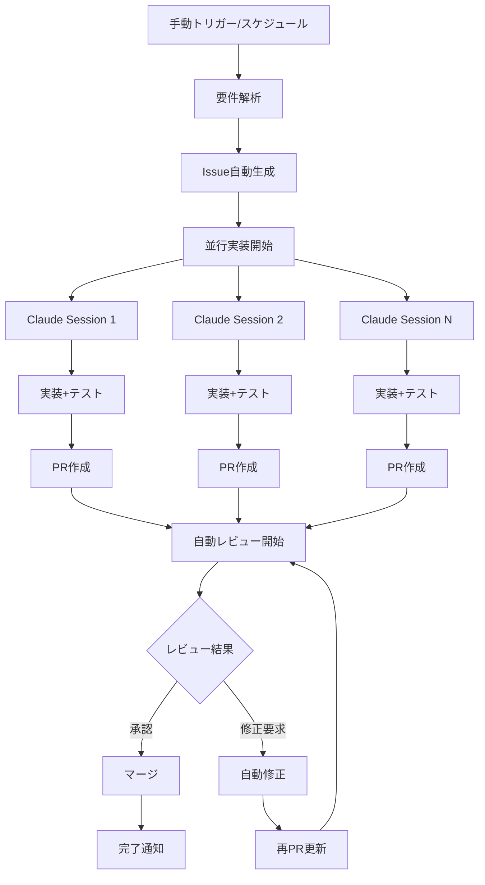

# AI駆動自動開発ワークフロー設計書

## 概要
Claude CodeとGitHub Actionsを活用した完全自動化開発フローを構築し、Issue生成からPRレビュー・修正まで無人で実行する。

## 全体フロー



## フェーズ別実装計画

### Phase 1: 基盤構築 (1週間)
- GitHub Actions環境セットアップ
- Claude Code API連携基盤
- 設定ファイル・テンプレート作成
- エラーハンドリング・ログ機能

### Phase 2: Issue自動生成 (3日)
- 要件定義書解析エンジン
- 未実装機能抽出ロジック
- Issue テンプレート自動生成
- ラベル・マイルストーン自動設定

### Phase 3: 並行実装システム (1週間)
- 複数Claude Codeセッション管理
- ブランチ戦略自動化
- 実装進捗追跡
- 依存関係解決

### Phase 4: 自動PR・レビューシステム (4日)
- PR自動作成・説明生成
- レビュー専用Claude設定
- 品質チェック自動化
- レビューコメント自動投稿

### Phase 5: 自動修正システム (3日)
- レビュー指摘解析
- 自動コード修正
- テスト実行・検証
- 再提出フロー

## 技術アーキテクチャ

### GitHub Actions ワークフロー構成

```yaml
# .github/workflows/ai-development.yml
name: AI Driven Development

on:
  workflow_dispatch:
    inputs:
      mode:
        description: 'Development mode'
        required: true
        default: 'full'
        type: choice
        options:
        - full          # 全自動実行
        - issues-only   # Issue生成のみ
        - implement     # 実装のみ
        - review        # レビューのみ

jobs:
  analyze-requirements:
    runs-on: ubuntu-latest
    outputs:
      issues: ${{ steps.analysis.outputs.issues }}
    steps:
      - uses: actions/checkout@v4
      - name: Analyze Requirements
        id: analysis
        run: |
          # 要件解析スクリプト実行

  generate-issues:
    needs: analyze-requirements
    runs-on: ubuntu-latest
    strategy:
      matrix:
        issue: ${{ fromJson(needs.analyze-requirements.outputs.issues) }}
    steps:
      - name: Create Issue
        run: |
          # Issue自動作成

  parallel-implementation:
    needs: generate-issues
    runs-on: ubuntu-latest
    strategy:
      max-parallel: 3  # 同時実行数制限
      matrix:
        issue-id: ${{ fromJson(needs.generate-issues.outputs.issue-ids) }}
    steps:
      - name: Setup Claude Code Environment
      - name: Implement Feature
      - name: Create Pull Request

  automated-review:
    needs: parallel-implementation
    runs-on: ubuntu-latest
    steps:
      - name: Review Pull Requests
      - name: Post Review Comments
      - name: Auto-fix Issues
```

### Claude Code API連携

```typescript
// scripts/claude-api.ts
export class ClaudeCodeAPI {
  private apiKey: string
  private baseUrl: string
  
  constructor() {
    this.apiKey = process.env.CLAUDE_CODE_API_KEY!
    this.baseUrl = 'https://api.claude.ai/code'
  }
  
  async createSession(config: SessionConfig): Promise<Session> {
    // Claude Codeセッション作成
  }
  
  async executeTask(sessionId: string, task: Task): Promise<Result> {
    // タスク実行
  }
  
  async parallelExecution(tasks: Task[]): Promise<Result[]> {
    // 並行実行管理
    const sessions = await Promise.all(
      tasks.map(task => this.createSession(task.config))
    )
    
    return Promise.all(
      sessions.map((session, i) => 
        this.executeTask(session.id, tasks[i])
      )
    )
  }
}
```

## Issue自動生成システム

### 要件解析エンジン

```typescript
// scripts/requirements-analyzer.ts
export class RequirementsAnalyzer {
  async analyzeProject(): Promise<UnimplementedFeature[]> {
    const requirements = await this.parseRequirements()
    const currentImplementation = await this.scanCodebase()
    const gaps = this.identifyGaps(requirements, currentImplementation)
    
    return this.prioritizeFeatures(gaps)
  }
  
  private async parseRequirements(): Promise<Requirement[]> {
    // CLAUDE.md, requirements.md解析
    const claudemd = await fs.readFile('CLAUDE.md', 'utf-8')
    const requirements = await fs.readFile('docs/requirements.md', 'utf-8')
    
    return this.extractFeatures([claudemd, requirements])
  }
  
  private async scanCodebase(): Promise<ImplementedFeature[]> {
    // 既存実装のスキャン
    const files = await glob('**/*.{ts,tsx,js,jsx}')
    return this.analyzeImplementation(files)
  }
}
```

### Issue テンプレート

```typescript
// templates/issue-template.ts
export const generateIssueTemplate = (feature: UnimplementedFeature) => `
## 📋 機能概要
${feature.description}

## 🎯 実装目標
${feature.goals.map(goal => `- [ ] ${goal}`).join('\n')}

## 📝 実装詳細
### ファイル構成
${feature.files.map(file => `- \`${file.path}\` - ${file.description}`).join('\n')}

### 技術要件
${feature.requirements.map(req => `- ${req}`).join('\n')}

## ✅ 受け入れ条件
${feature.acceptanceCriteria.map(criteria => `- [ ] ${criteria}`).join('\n')}

## 🧪 テスト要件
${feature.testRequirements.map(test => `- [ ] ${test}`).join('\n')}

## 🏷️ メタデータ
- **優先度**: ${feature.priority}
- **見積もり**: ${feature.estimate}
- **依存関係**: ${feature.dependencies.join(', ') || 'なし'}
- **関連Issue**: ${feature.relatedIssues.join(', ') || 'なし'}

---
*🤖 このIssueはAI駆動開発ワークフローにより自動生成されました*
`
```

## 並行実装システム

### セッション管理

```typescript
// scripts/session-manager.ts
export class SessionManager {
  private sessions: Map<string, ClaudeSession> = new Map()
  private maxConcurrency = 3
  
  async executeParallelImplementation(issues: Issue[]): Promise<void> {
    const batches = this.createBatches(issues, this.maxConcurrency)
    
    for (const batch of batches) {
      await Promise.all(
        batch.map(issue => this.implementFeature(issue))
      )
    }
  }
  
  private async implementFeature(issue: Issue): Promise<void> {
    const session = await this.createImplementationSession(issue)
    
    try {
      // 1. ブランチ作成
      await session.execute(`
        git checkout -b feature/${issue.number}-${issue.slug}
      `)
      
      // 2. 実装
      await session.execute(`
        以下のIssueを実装してください：
        ${issue.description}
        
        実装要件：
        ${issue.requirements.join('\n')}
        
        CLAUDE.mdの規約に従って実装してください。
      `)
      
      // 3. テスト作成
      await session.execute(`
        実装したコードに対応するテストを作成してください。
        カバレッジ80%以上を目標にしてください。
      `)
      
      // 4. PR作成
      await this.createPullRequest(session, issue)
      
    } finally {
      this.cleanupSession(session)
    }
  }
}
```

## 自動レビューシステム

### レビュー専用Claude設定

```typescript
// scripts/auto-reviewer.ts
export class AutoReviewer {
  private reviewerSession: ClaudeSession
  
  async reviewPullRequest(pr: PullRequest): Promise<Review> {
    const analysis = await this.analyzeChanges(pr)
    const review = await this.generateReview(analysis)
    
    await this.postReview(pr, review)
    return review
  }
  
  private async analyzeChanges(pr: PullRequest): Promise<AnalysisResult> {
    return this.reviewerSession.execute(`
      以下のPull Requestをレビューしてください：
      
      ## 変更内容
      ${pr.diff}
      
      ## レビューポイント
      1. コード品質（命名、構造、可読性）
      2. セキュリティ（脆弱性、データ漏洩リスク）
      3. パフォーマンス（効率性、最適化）
      4. テスト（カバレッジ、テストケース）
      5. CLAUDE.md規約準拠
      6. 機能要件満足度
      
      ## 出力形式
      JSON形式で以下を出力：
      {
        "overall": "approve|request_changes|comment",
        "score": 0-100,
        "issues": [
          {
            "severity": "critical|major|minor|suggestion",
            "file": "ファイルパス",
            "line": 行番号,
            "message": "指摘内容",
            "suggestion": "修正案"
          }
        ],
        "summary": "レビュー総評"
      }
    `)
  }
}
```

## 自動修正システム

### 修正エンジン

```typescript
// scripts/auto-fixer.ts
export class AutoFixer {
  async fixReviewIssues(pr: PullRequest, review: Review): Promise<void> {
    const criticalIssues = review.issues.filter(i => i.severity === 'critical')
    const majorIssues = review.issues.filter(i => i.severity === 'major')
    
    // 重要度順に修正
    for (const issue of [...criticalIssues, ...majorIssues]) {
      await this.fixIssue(pr, issue)
    }
    
    // テスト実行
    await this.runTests(pr)
    
    // 修正内容をコミット
    await this.commitFixes(pr)
  }
  
  private async fixIssue(pr: PullRequest, issue: ReviewIssue): Promise<void> {
    const session = await this.createFixSession(pr)
    
    await session.execute(`
      以下のレビュー指摘を修正してください：
      
      ファイル: ${issue.file}
      行: ${issue.line}
      指摘: ${issue.message}
      修正案: ${issue.suggestion}
      
      CLAUDE.mdの規約に従って修正してください。
      修正後はテストも更新してください。
    `)
  }
}
```

## 設定ファイル

### ワークフロー設定

```yaml
# .github/workflows/config/ai-development.yml
ai_development:
  max_parallel_sessions: 3
  session_timeout: 3600  # 1時間
  retry_attempts: 3
  
  claude_code:
    api_endpoint: "https://api.claude.ai/code"
    model: "claude-sonnet-4"
    temperature: 0.1
    
  review_criteria:
    required_score: 80
    auto_approve_threshold: 95
    critical_issues_block: true
    
  notifications:
    slack_webhook: ${{ secrets.SLACK_WEBHOOK }}
    discord_webhook: ${{ secrets.DISCORD_WEBHOOK }}
```

### セキュリティ設定

```yaml
# Secrets Required:
# CLAUDE_CODE_API_KEY    - Claude Code API キー
# GITHUB_TOKEN          - GitHub Personal Access Token
# SLACK_WEBHOOK         - Slack通知用Webhook (optional)
# DISCORD_WEBHOOK       - Discord通知用Webhook (optional)
```

## 監視・ログ機能

### ダッシュボード

```typescript
// scripts/dashboard.ts
export class DevelopmentDashboard {
  async generateReport(): Promise<DashboardData> {
    return {
      activeJobs: await this.getActiveJobs(),
      completedToday: await this.getCompletedToday(),
      successRate: await this.calculateSuccessRate(),
      avgImplementationTime: await this.getAvgTime(),
      issueBacklog: await this.getIssueBacklog(),
      reviewStats: await this.getReviewStats()
    }
  }
}
```

## 実行コマンド

```bash
# 全自動実行
gh workflow run ai-development.yml -f mode=full

# Issue生成のみ
gh workflow run ai-development.yml -f mode=issues-only

# 特定機能の実装
gh workflow run ai-development.yml -f mode=implement -f feature=camera

# レビューのみ実行
gh workflow run ai-development.yml -f mode=review
```

## エラー処理・フォールバック

### 自動復旧機能
- API制限時の自動リトライ
- セッション失敗時の別セッション起動
- 実装失敗時の人間への引き継ぎ
- 緊急停止機能

### 品質保証
- 実装前後のテスト自動実行
- セキュリティスキャン自動実行
- パフォーマンステスト自動実行
- 依存関係チェック

## 効果測定指標

- **開発速度**: 従来比3-5倍の高速化目標
- **品質**: バグ発生率50%削減
- **カバレッジ**: テストカバレッジ90%以上維持
- **レビュー効率**: レビュー時間80%削減
- **開発者満足度**: 定性的評価の改善

---

*この設計書は、AI駆動開発の未来を実現するための革新的アプローチです。段階的な実装により、リスクを抑えながら効果的な自動化を実現します。*