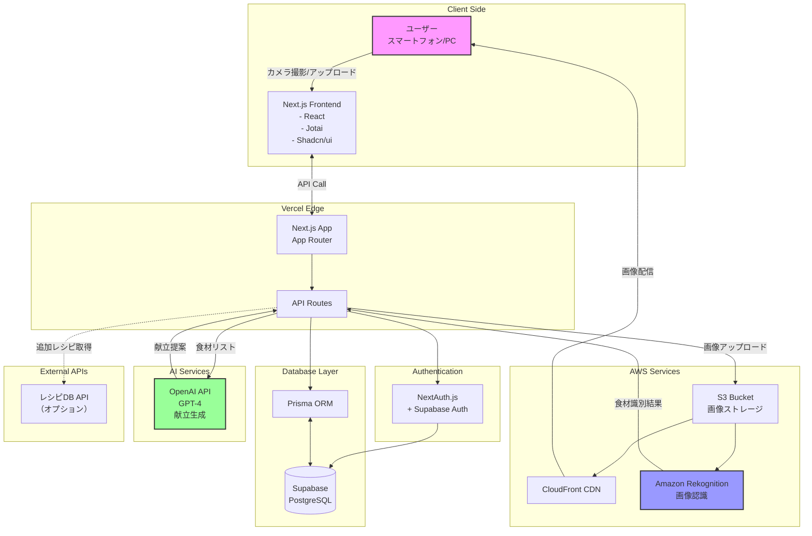
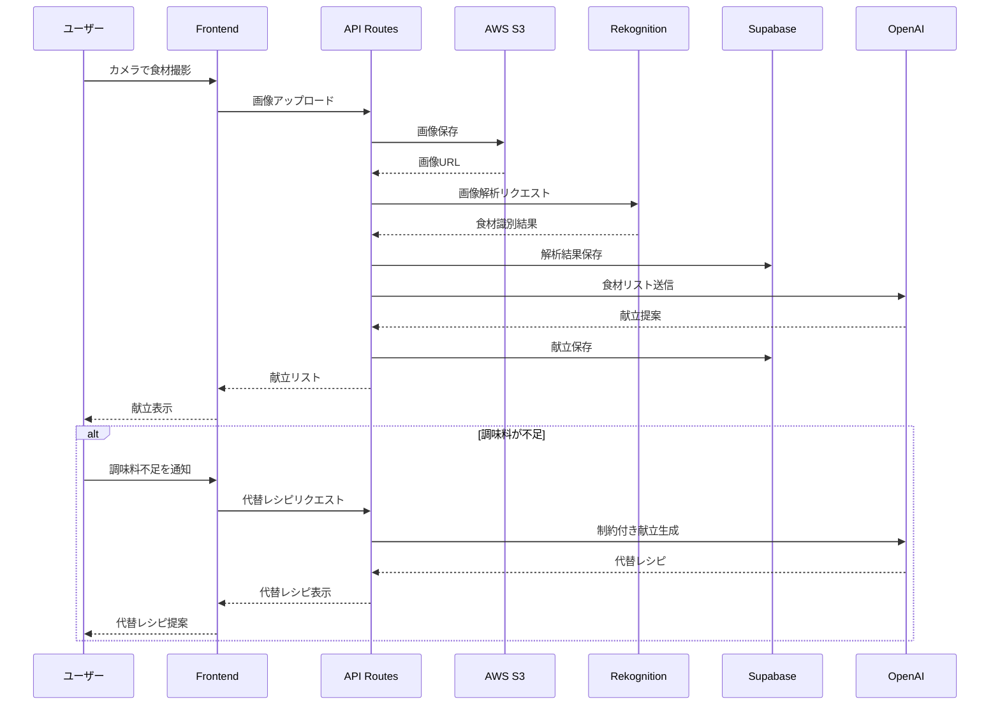
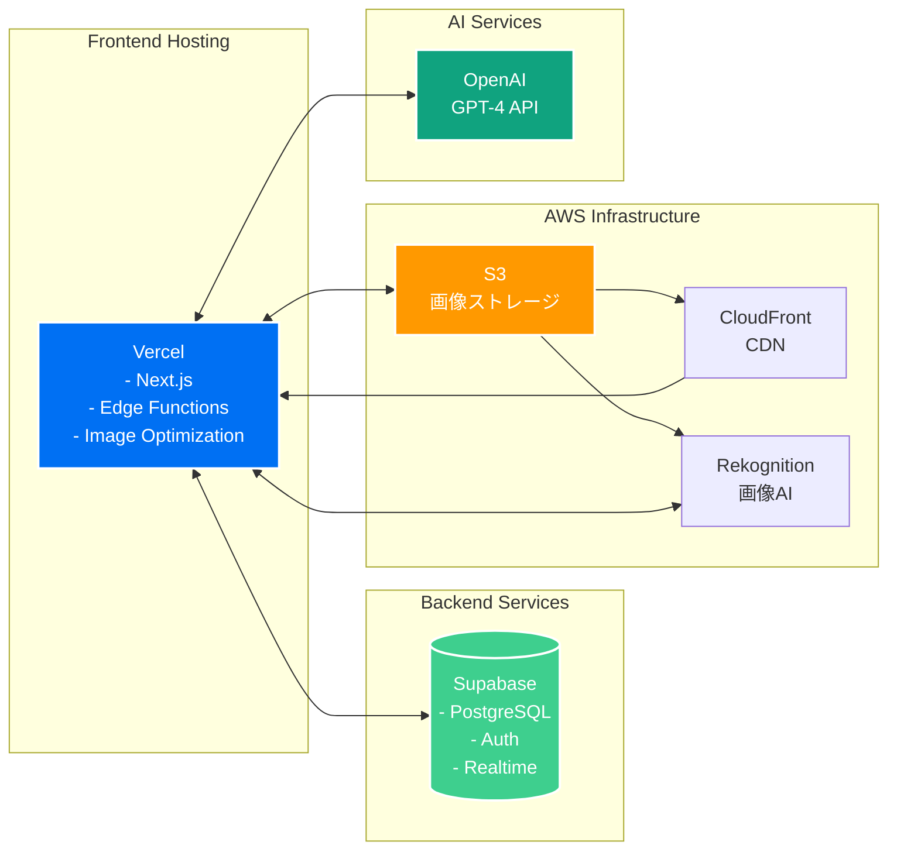

# システム構成図

## 画像認識APIの比較

### Amazon Rekognition（推奨）
**メリット：**
- AWS S3との完全な統合
- 日本語対応が充実
- 料金体系が明確（1,000画像あたり$1〜）
- 食品認識の精度が高い
- バッチ処理に対応

**デメリット：**
- AWSエコシステムへの依存

### Google Cloud Vision API
**メリット：**
- 高精度な物体検出
- 多言語対応
- REST APIが使いやすい

**デメリット：**
- S3との連携に追加実装が必要
- 料金がやや高め

## システム構成図

## データフロー図

## インフラ構成

## セキュリティ構成

- **認証**: Supabase Auth + NextAuth.js
- **API保護**: JWT認証
- **画像アクセス**: S3 Presigned URLs
- **環境変数管理**: Vercel環境変数
- **CORS設定**: Vercelで制御